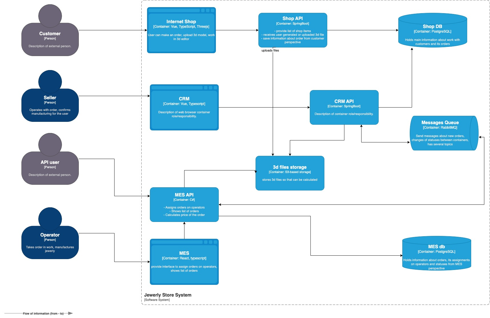

# О компании

Компания «Александрит» занимается производством ювелирных украшений — готовых и на заказ. Фишка компании в том, что пользователь может самостоятельно разработать дизайн украшения. На сайте можно:
- загрузить свой файл с 3D-моделью изделия,
- воспользоваться конструктором, чтобы создать 3D-модель из готовых элементов.

Компания начинала с продажи простых ювелирных украшений, но потом решила попробовать производство на заказ, и оно «взлетело». Тогда же компания организовала своё производство изделий — до этого она перекупала изделия у других производителей.

Сейчас у «Александрита» есть отдельная CRM для работы с клиентами и MES для производства.

Компания купила софт MES вместе с исходным кодом. MES рассчитывает стоимость производства изделия на своей стороне, приложение онлайн-магазина в расчётах не участвует. Это была одна из причин, почему компания выбрала именно это решение. Расчёт стоимости в среднем занимает 2-3 минуты. Скорость расчёта зависит от количества полигонов в 3D-модели. Если модель сложная и детализированная, время обработки может достигать 30 минут.

MES и CRM взаимодействуют друг с другом через RabbitMQ. Эту интеграцию реализовала команда «Александрита».

## Проблемы компании

В этом году компания осваивает новые рынки сбыта. Нагрузка растёт линейно. В среднем каждый месяц «Александрит» получает на 100 заказов больше, чем в предыдущий. Но тут появились проблемы с заказами. Клиенты жалуются менеджерам по продажам, что они не получили заказ и над их изделием работают уже несколько месяцев, хотя обещали закончить за три недели. Проблемы не на стороне производства: производственные мощности позволяют справиться с заказами и могут обеспечить двукратный рост.

Во втором квартале «Александрит» начал принимать заказы от других продавцов ювелирных изделий, чтобы дополнительно увеличить охват. Для этого компания открыла свой API, который MES использует для расчёта стоимости изделия. В этом сценарии заказ создаётся в CRM через получение сообщения из очереди от MES. Как только «Александрит» внедрил эту возможность, компанию завалило заказами. Но есть и обратная сторона: жалоб от клиентов на просроченные заказы стало ещё больше.

Добавились жалобы со стороны пользователей API. Представители компаний ежедневно сообщают, что не получили свои заказы.

Участились жалобы от операторов: когда они заходят на первую страницу MES, система долго прогружается. На первой странице отображается список заказов в работе по статусам — это дашборд с фильтром. Раньше страница показывала все заказы, но это тормозило загрузку. Команда сделала фильтр по статусам и пагинацию, но это не помогло. Операторам важно видеть самые новые заказы, потому что от этого зависит их вознаграждение, — кто взял заказ, тот и получит оплату.

Через месяц после открытия API компания потеряла уже несколько крупных контрактов из-за проблем с заказами. Недовольство клиентов онлайн-магазина (B2C) тоже растёт. 

Как раз в это время вы начинаете работать в «Александрите» как архитектор. Компания наняла вас в первом квартале, чтобы решить технические проблемы, ещё до открытия API пользователям. Похоже, вам предстоит крещение огнём!

# Как устроена архитектура

Система состоит из трёх приложений:
- Онлайн-магазин — написан на Vue и Java Spring Boot.
- CRM — SPA-приложение, фронтэнд написан на Vue, бэкенд — на Java Spring Boot.
- MES — SPA-приложение, фронтенд написан на React, бэкенд — на C#.

Во всех приложениях есть аутентификация и авторизация. Договоримся, что там проблем нет. Вы можете не брать во внимание эту функциональность при работе над заданием.

Окружений всего три: dev, release и prod. 

Если говорить про инфраструктуру, то сервис начинался как on-premise. Сейчас всё уже перенесли в облако. Каждый из инстансов крутится как EC2, базы данных — это Managed services на Yandex Cloud. Каждое приложение имеет по одному инстансу. Базы данных имеют один инстанс, который работает на запись и на чтение.

CI/CD реализован так:

- Деплой в dev-окружение осуществляется автоматически после мёрджа пул-реквеста и прохождения юнит-тестов.
- В release-окружения версию деплоят вручную.
- В продакшн версию тоже деплоят вручную.

### Статусы заказа
Вот описание статусов заказа. В скобках указана система, в которой происходит изменение:
- INITIATED (онлайн-магазин) — пользователь завёл новый заказ или положил товары в пустую корзину.
- FILE_UPLOADED (онлайн-магазин) — пользователь загрузил файл с 3D-моделью или создал его с помощью конструктора.
- SUBMITTED (онлайн-магазин) — пользователь нажал на кнопку «Сделать заказ».
- PRICE_CALCULATED (MES) — система посчитала стоимость заказа.
- MANUFACTURING_APPROVED (CRM) — заказ подтверждён, его можно отдавать в производство.
- MANUFACTURING_STARTED (MES) — оператор взял заказ в работу.
- MANUFACTURING_COMPLETED (MES) — оператор выполнил заказ.
- PACKAGING (MES) — оператор начал упаковывать заказ.
- SHIPPED (MES) — заказ отправлен покупателю.
- CLOSED (CRM) — заказ завершён. Он закрывается после получения сообщения от транспортной компании или вручную.

### Кто есть в команде
В инженерной команде, кроме вас, работает ещё восемь человек:
- Фронтенд — два инженера Vue, один частично знает React.
- Бэкенд — два инженера Java, один разработчик на C#.
- QA — один инженер по ручному тестированию, хочет заняться автоматизацией и уже делал несколько прототипов.
- Тимлид — бывший разработчик на C#.
- Продакт-менеджер — общается с бизнесом, отвечает за поддержку приложения.
- Один DevOps-инженер.

На стороне бизнеса в «Александрите» работают:
- Продавцы — это пользователи CRM.
- Операторы — пользователи MES.
- Администраторы — к ним относятся продакт-менеджер, тимлид и менеджеры по продажам.

Учитывайте, что наём потенциально активный. Компания может набрать ещё людей, но нужно обосновать, кто и зачем нужен.

### Как выстроены процессы

Команда выпускает софт двухнедельными спринтами. Есть тестовое окружение, на нём QA-инженер прогоняет E2E-сценарии вручную. Если он обнаруживает баги уровня high или highest, то версию не деплоят на продакшн до их починки. Это часто приводит к значительным задержкам релиза. Раньше задержки не превышали одного месяца, но в последнее время требуется всё больше и больше времени.